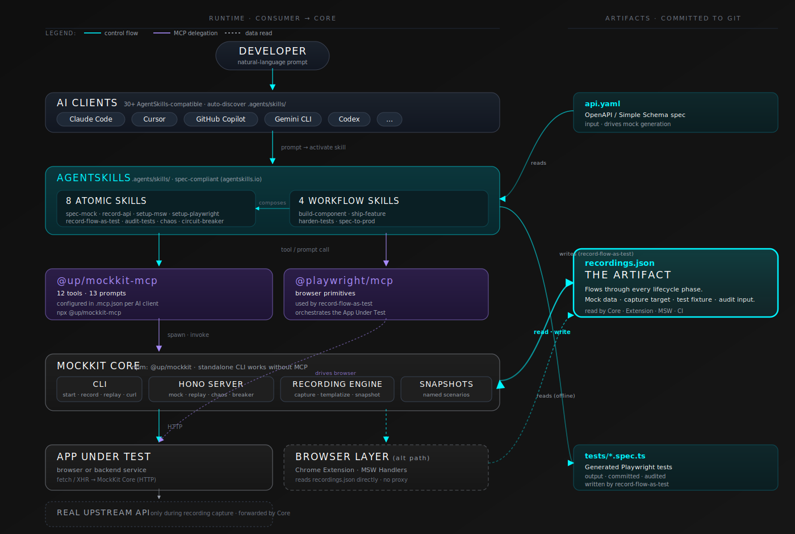
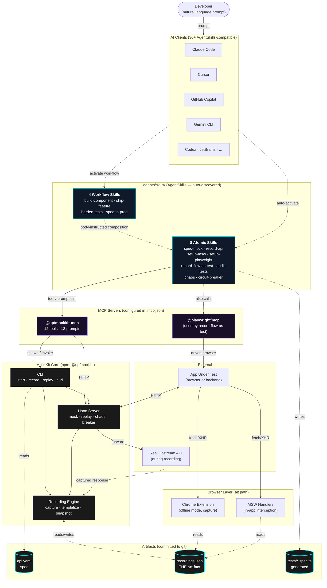

# MockKit Architecture

How the pieces fit together — from the developer typing a prompt, through the AgentSkills layer, the MCP server, MockKit core, and out to the artifacts that flow through the lifecycle.

## The full picture



> The thick cyan border + glow on `recordings.json` is intentional — it's the focal point. Every layer either reads from it or writes to it. That's the throughline.

## Mermaid version (renders inline on GitHub if SVG is blocked)



## How to read it

The diagram has **six horizontal layers** plus two side groupings.

1. **Developer** — types a natural-language prompt. Doesn't know or care which skill runs.
2. **AI Clients** — Claude Code, Cursor, Copilot, Gemini CLI, etc. Auto-discover the skills in `.agents/skills/` at startup.
3. **AgentSkills** — model auto-activates the matching atomic skill based on the prompt. Workflow skills compose atomics via body instructions (no spec primitive).
4. **MCP Servers** — atomic skills call into MockKit MCP for tools/prompts; the `record-flow-as-test` skill additionally orchestrates Playwright MCP for browser control.
5. **MockKit Core** — the actual mocking implementation: CLI, Hono server, recording engine. The MCP server is a thin wrapper that calls into here.
6. **Browser Layer** (alt path) — for browser-side mocking, the Chrome extension and MSW handlers serve recordings directly without going through the core HTTP server.

**Side groupings:**
- **Artifacts** — files committed to git. `recordings.json` is the central one; spec is input, tests are output.
- **External** — the app under test and (during recording) the real upstream API.

## The throughline

The whole point of the diagram: **`recordings.json` is the only thing that flows through every lifecycle phase**.

- **Day 0**: Recording is empty. Mock generates from spec.
- **Week 1**: Recording captures real upstream responses.
- **Day-to-day**: Recording is the offline cache (extension, MSW, replay all consume it).
- **Pre-merge**: Recording is the test fixture.
- **Forever**: Recording stays in git. Audit tests against it; chaos perturbs the responses on top of it.

Every other component is plumbing. The recording is the contract.

## Data flow examples

### Example A — Day 0 (spec → mock → component)

```
Dev → "Stand up a mock from api.yaml and scaffold IncidentList"
   ↓
AI Client auto-activates spec-mock + setup-msw + (component scaffold)
   ↓
spec-mock calls @up/mockkit-mcp  →  CLI: mockkit start -s api.yaml
   ↓
Hono Server starts on :9876, generates responses from api.yaml
   ↓
App fetches → Server responds (no recording yet, generated from spec)
```

### Example B — Pre-merge (flow → test)

```
Dev → "Record this flow as a Playwright test"
   ↓
AI Client auto-activates record-flow-as-test
   ↓
Skill calls @up/mockkit-mcp     →  Server up with seed=42 (deterministic)
Skill calls @playwright/mcp     →  Drives the browser
   ↓
Browser fetches → Server responds from spec (or recordings.json)
   ↓
Skill captures aria snapshots → synthesizes tests/<flow>.spec.ts
   ↓
Test runs against same Server → green
```

### Example C — Forever (audit + chaos)

```
Dev → "Audit tests for fragility, apply HIGH/MEDIUM fixes"
   ↓
AI Client auto-activates audit-tests
   ↓
Skill calls @up/mockkit-mcp → audit-test-quality prompt
   ↓
Reads tests/*.spec.ts, walks 9 patterns, applies fixes
   ↓
Re-runs suite against same Server → green, faster
```

## Key design choices

| Choice | Why |
|---|---|
| Skills wrap MCP prompts (don't reinvent) | Single source of truth for prompt content; spec-compliant skills with proprietary `metadata` fields for the wiring |
| MCP server is thin (delegates to core) | Core works standalone via CLI; MCP is just a calling convention for AI |
| Recording is JSON, not a binary | Diff-able in git, hand-editable, language-agnostic |
| Chrome extension reads recordings directly | No proxy required for offline dev; faster than message round-trip |
| Workflow skills compose via body instructions | Spec deliberately omits composition primitive — model chains atomics by following the markdown body |

## What's NOT in the diagram (intentionally)

- **CI runners** — they just invoke `mockkit replay` like any other process.
- **The preview package** — it's a separate Next.js app for visualizing recordings; orthogonal to the runtime path.
- **GitHub / Linear / Slack MCP servers** — the AI client may have many MCPs; only MockKit + Playwright are part of MockKit's story.
- **Telemetry / observability** — none today; would be a future layer above Core.
