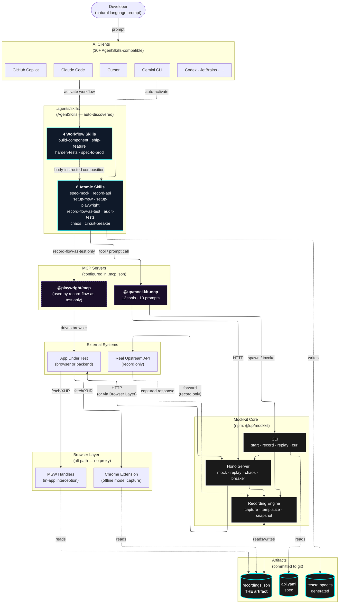
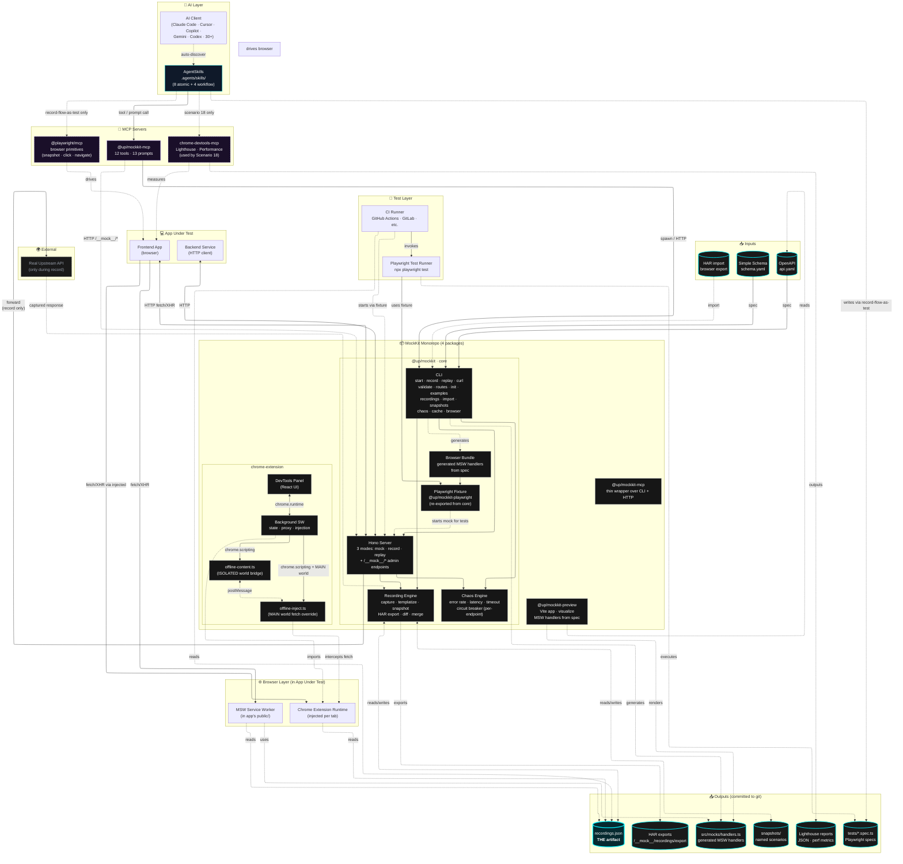

# MockKit Architecture

How the pieces fit together — from the developer typing a prompt, through the AgentSkills layer, the MCP server, MockKit core, and out to the artifacts that flow through the lifecycle.

## The full picture



> **Renderer note:** the `layout: elk` directive needs Mermaid v11+. GitHub renders Mermaid 10.x as of late 2025 and silently falls back to dagre — still readable, just less cleanly routed. VS Code, Obsidian (with the Mermaid v11 plugin), and most modern doc viewers will render with ELK.

### Render-anywhere fallback (SVG)

If your viewer blocks Mermaid or you want pixel-perfect output:


The thick cyan border + glow on `recordings.json` is intentional — it's the focal point. Every layer either reads from it or writes to it.

---

## Complete system map (reference)

The lifecycle view above is narrative — focused on the AI-driven dev loop. This map is exhaustive: every published package, every MCP server, every input/output, every consumer. Use it to answer "what connects to what."



### Reading the system map

Six logical groupings (matched to the icons in the subgraph titles):

| Group | What it contains | Lives where |
|---|---|---|
| 📥 **Inputs** | OpenAPI / Simple Schema specs, HAR imports | User-provided, in repo |
| 🤖 **AI Layer** | AI client + AgentSkills | Client config + `.agents/skills/` |
| 🔌 **MCP Servers** | mockkit-mcp + playwright-mcp + chrome-devtools-mcp | `.mcp.json` |
| 📦 **MockKit Monorepo** | Core, MCP wrapper, Chrome extension, Preview | `packages/` in mockkit repo |
| 🌐 **Browser Layer** | MSW worker, Chrome extension runtime | Injected into the App Under Test |
| 🧪 **Test Layer** | Playwright runner, CI runner | Wherever you run tests |
| 📤 **Outputs** | recordings, snapshots, tests, HAR exports, Lighthouse reports, MSW handlers | All committed to git |
| 💻 **Apps** | Frontend (browser), Backend (HTTP client) | The thing being tested |
| 🌍 **External** | Real upstream API (only during record) | Third party |

### Lookup: "What connects to what?"

Common questions and where to find the answer in the map:

| Question | Path through the map |
|---|---|
| How does `mockkit start -s api.yaml` work? | `OAS → CLI → Hono`, then App fetches `Hono` over HTTP |
| How does the AI generate a Playwright test? | `AIClient → SkillsRepo (record-flow-as-test) → PlayMCP → drives FE`, simultaneously `→ MockMCP → Hono` for deterministic backend, then writes to `Tests` |
| How does Lighthouse audit fit in? | `AIClient → SkillsRepo → DevToolsMCP → measures FE → outputs Lighthouse reports` (used in Scenario 18) |
| How does the Chrome extension intercept fetch? | `BG → chrome.scripting → CSMain (MAIN world) → intercepts fetch in ExtRuntime → reads Recs` |
| How does MSW serve the recording? | `MSWBrowser (running in app's service worker) → reads MSWFiles → falls back to Recs for capture-mode replays` |
| How does CI run a Playwright suite without a backend? | `CIRunner → PWRunner → PWFix (starts Hono in mock/replay mode) → Tests run against Hono → reads Recs` |
| What's the difference between `mockkit-mcp` and `mockkit`? | `mockkit-mcp` is a thin wrapper that spawns `mockkit` CLI / talks HTTP to its `Hono` server. The MCP server doesn't replicate Core capabilities — it exposes them. |
| Is the Preview app required? | No. `Preview` reads `OAS` and renders `MSWFiles` for visualization only. Orthogonal to the runtime path. |
| When does the proxy hit upstream? | `Hono → forward → Upstream` only fires during `mockkit record`. In `mock` and `replay` modes, that arrow is dormant. |

## How to read it

The diagram has **six horizontal layers** plus two side groupings.

1. **Developer** — types a natural-language prompt. Doesn't know or care which skill runs.
2. **AI Clients** — Claude Code, Cursor, Copilot, Gemini CLI, etc. Auto-discover the skills in `.agents/skills/` at startup.
3. **AgentSkills** — model auto-activates the matching atomic skill based on the prompt. Workflow skills compose atomics via body instructions (no spec primitive).
4. **MCP Servers** — atomic skills call into MockKit MCP for tools/prompts; the `record-flow-as-test` skill additionally orchestrates Playwright MCP for browser control.
5. **MockKit Core** — the actual mocking implementation: CLI, Hono server, recording engine. The MCP server is a thin wrapper that calls into here.
6. **Browser Layer** (alt path) — for browser-side mocking, the Chrome extension and MSW handlers serve recordings directly without going through the core HTTP server.

**Side groupings:**
- **Artifacts** — files committed to git. `recordings.json` is the central one; spec is input, tests are output.
- **External** — the app under test and (during recording) the real upstream API.

## The throughline

The whole point of the diagram: **`recordings.json` is the only thing that flows through every lifecycle phase**.

- **Day 0**: Recording is empty. Mock generates from spec.
- **Week 1**: Recording captures real upstream responses.
- **Day-to-day**: Recording is the offline cache (extension, MSW, replay all consume it).
- **Pre-merge**: Recording is the test fixture.
- **Forever**: Recording stays in git. Audit tests against it; chaos perturbs the responses on top of it.

Every other component is plumbing. The recording is the contract.

## Data flow examples

### Example A — Day 0 (spec → mock → component)

```
Dev → "Stand up a mock from api.yaml and scaffold IncidentList"
   ↓
AI Client auto-activates spec-mock + setup-msw + (component scaffold)
   ↓
spec-mock calls @up/mockkit-mcp  →  CLI: mockkit start -s api.yaml
   ↓
Hono Server starts on :9876, generates responses from api.yaml
   ↓
App fetches → Server responds (no recording yet, generated from spec)
```

### Example B — Pre-merge (flow → test)

```
Dev → "Record this flow as a Playwright test"
   ↓
AI Client auto-activates record-flow-as-test
   ↓
Skill calls @up/mockkit-mcp     →  Server up with seed=42 (deterministic)
Skill calls @playwright/mcp     →  Drives the browser
   ↓
Browser fetches → Server responds from spec (or recordings.json)
   ↓
Skill captures aria snapshots → synthesizes tests/<flow>.spec.ts
   ↓
Test runs against same Server → green
```

### Example C — Forever (audit + chaos)

```
Dev → "Audit tests for fragility, apply HIGH/MEDIUM fixes"
   ↓
AI Client auto-activates audit-tests
   ↓
Skill calls @up/mockkit-mcp → audit-test-quality prompt
   ↓
Reads tests/*.spec.ts, walks 9 patterns, applies fixes
   ↓
Re-runs suite against same Server → green, faster
```

## Key design choices

| Choice | Why |
|---|---|
| Skills wrap MCP prompts (don't reinvent) | Single source of truth for prompt content; spec-compliant skills with proprietary `metadata` fields for the wiring |
| MCP server is thin (delegates to core) | Core works standalone via CLI; MCP is just a calling convention for AI |
| Recording is JSON, not a binary | Diff-able in git, hand-editable, language-agnostic |
| Chrome extension reads recordings directly | No proxy required for offline dev; faster than message round-trip |
| Workflow skills compose via body instructions | Spec deliberately omits composition primitive — model chains atomics by following the markdown body |

## What's NOT in the diagram (intentionally)

- **CI runners** — they just invoke `mockkit replay` like any other process.
- **The preview package** — it's a separate Next.js app for visualizing recordings; orthogonal to the runtime path.
- **GitHub / Linear / Slack MCP servers** — the AI client may have many MCPs; only MockKit + Playwright are part of MockKit's story.
- **Telemetry / observability** — none today; would be a future layer above Core.
